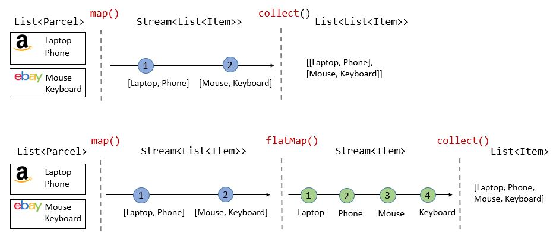

# What's the difference between map() and flatMap() methods in Java 8?

*[link](https://stackoverflow.com/questions/26684562/whats-the-difference-between-map-and-flatmap-methods-in-java-8)

Both map and flatMap can be applied to a Stream<T> and they both return a Stream<R>. The difference is that the map operation produces one output value for each input value, whereas the flatMap operation produces an arbitrary number (zero or more) values for each input value.

This is reflected in the arguments to each operation.

The map operation takes a Function, which is called for each value in the input stream and produces one result value, which is sent to the output stream.

The flatMap operation takes a function that conceptually wants to consume one value and produce an arbitrary number of values. However, in Java, it's cumbersome for a method to return an arbitrary number of values, since methods can return only zero or one value. One could imagine an API where the mapper function for flatMap takes a value and returns an array or a List of values, which are then sent to the output. Given that this is the streams library, a particularly apt way to represent an arbitrary number of return values is for the mapper function itself to return a stream! The values from the stream returned by the mapper are drained from the stream and are passed to the output stream. The "clumps" of values returned by each call to the mapper function are not distinguished at all in the output stream, thus the output is said to have been "flattened."

Typical use is for the mapper function of flatMap to return Stream.empty() if it wants to send zero values, or something like Stream.of(a, b, c) if it wants to return several values. But of course any stream can be returned.


One line answer: flatMap helps to flatten a Collection<Collection<T>> into a Collection<T>. In the same way, it will also flatten an Optional<Optional<T>> into Optional<T>.


<p align="center">
  
  <br/>
</p>

As you can see, with map() only:

The intermediate type is Stream<List<Item>>
The return type is List<List<Item>>
and with flatMap():

The intermediate type is Stream<Item>
The return type is List<Item>
This is the test result from the code used right below:

-------- Without flatMap() -------------------------------
     collect() returns: [[Laptop, Phone], [Mouse, Keyboard]]

-------- With flatMap() ----------------------------------
     collect() returns: [Laptop, Phone, Mouse, Keyboard]
     
```     
 import java.util.Arrays;
import java.util.Collection;
import java.util.List;
import java.util.stream.Collectors;

public class Parcel {
  String name;
  List<String> items;

  public Parcel(String name, String... items) {
    this.name = name;
    this.items = Arrays.asList(items);
  }

  public List<String> getItems() {
    return items;
  }

  public static void main(String[] args) {
    Parcel amazon = new Parcel("amazon", "Laptop", "Phone");
    Parcel ebay = new Parcel("ebay", "Mouse", "Keyboard");
    List<Parcel> parcels = Arrays.asList(amazon, ebay);

    System.out.println("-------- Without flatMap() ---------------------------");
    List<List<String>> mapReturn = parcels.stream()
      .map(Parcel::getItems)
      .collect(Collectors.toList());
    System.out.println("\t collect() returns: " + mapReturn);

    System.out.println("\n-------- With flatMap() ------------------------------");
    List<String> flatMapReturn = parcels.stream()
      .map(Parcel::getItems)
      .flatMap(Collection::stream)
      .collect(Collectors.toList());
    System.out.println("\t collect() returns: " + flatMapReturn);
  }
}
 
```